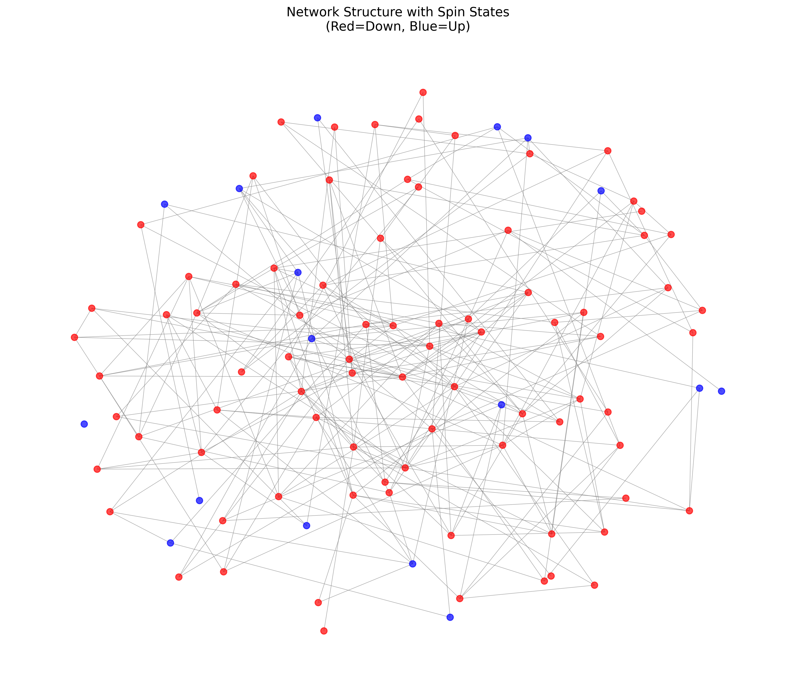
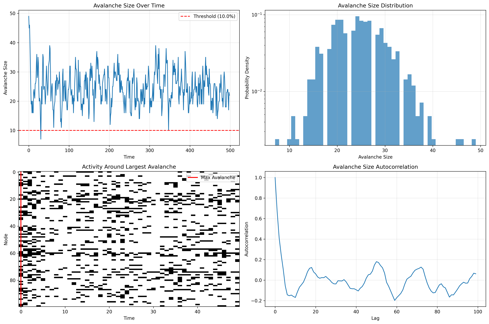
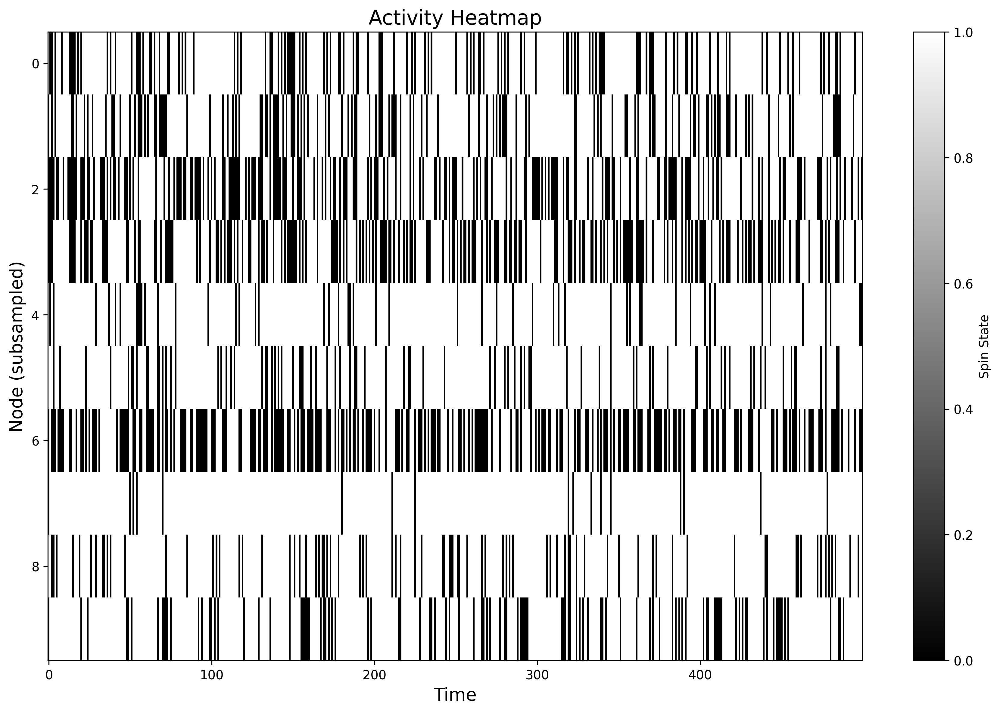

# Ising Model Network Dynamics Simulation Framework

A comprehensive Python framework for simulating Ising-like network dynamics with variational free energy calculations, learning capabilities, and extensive visualization tools.

## Quick Start

### Installation

```bash
# Install dependencies
pip install -r requirements.txt

# Run comprehensive demo
python run_demos.py
```

### Basic Usage

```python
from src.main import IsingNetworkSimulator

# Create simulator
simulator = IsingNetworkSimulator(n_nodes=100, connection_prob=0.05)

# Create network
simulator.create_network('erdos_renyi')

# Run simulation
initial_spins, initial_posteriors = simulator.initialize_system()
phi_hist, spin_hist, kld_hist, accur_hist = simulator.run_simulation(
    time_steps=500,
    initial_spins=initial_spins,
    initial_posteriors=initial_posteriors,
    po=0.65
)
```

## Project Structure

```
ising-model/
├── src/
│   ├── main.py                 # Main Ising model simulator
│   ├── vectorized.py           # Vectorized implementation with learning
│   ├── parameter_sweep.py      # Parameter sweep utilities
│   ├── visualization.py        # Visualization tools
│   ├── simulation/
│   │   ├── simulation.py       # Core simulation classes
│   │   └── config.py          # Configuration and utilities
│   ├── exponential_term/
│   │   └── main.py            # Exponential term analysis
│   └── utils/
│       ├── math.py            # Mathematical utilities
│       └── plotting.py        # Plotting utilities
├── plots/                     # Generated visualizations
├── requirements.txt           # Python dependencies
├── setup.py                  # Package setup
└── run_demos.py              # Comprehensive demo runner
```

## About

The simulation implements Ising-like dynamics with variational free energy calculations:

- **Spin states**: Binary variables (0/up, 1/down) representing node states
- **Posterior beliefs (φ)**: Probability that a node is in the down state
- **Observation likelihood (po)**: Controls system sensitivity and regime transitions
- **Network effects**: Neighboring spins influence each other through the adjacency matrix
- **Variational Free Energy**: Decomposed into complexity and accuracy terms

### Core Equations

The system evolves according to variational update rules:

1. **Posterior Update**: φ = 1/(1 + exp(-ΔE))
2. **Energy Difference**: ΔE = W·s + θ
3. **Variational Free Energy**: F = Complexity - Accuracy

## Visualizations and Results

### Main Ising Model Demo

#### Network Visualization
Final-time snapshot of the graph with nodes colored by spin state (Red = 1/down, Blue = 0/up). Shows the spatial structure of the network and how spin states cluster or distribute across the topology at equilibrium.



#### Phase Space Trajectories
Time traces of posterior beliefs (φ) for a small set of nodes. Color gradient progresses through time; start points in green, end points in red. Reveals how individual nodes evolve their beliefs over time and whether they converge to stable states or exhibit complex dynamics.


#### Spin-Spin Correlation Matrix
Pearson correlation of node activities over a selected time window. Values range from -1 (anti-correlated) to +1 (perfectly correlated). Large networks are subsampled for readability. Identifies which nodes tend to synchronize their behavior and reveals community structure or clustering patterns.


#### Avalanche Analysis
Four panels analyzing cascade dynamics:
1. **Avalanche size over time** with detection threshold
2. **Distribution of non-zero avalanche sizes** (log-scaled y-axis) - power-law distributions indicate criticality
3. **Activity heatmap around the largest avalanche** with peak marked in red
4. **Autocorrelation of avalanche sizes** across time lags showing temporal dependencies



#### Energy Landscape
Four panels capturing macroscopic system dynamics:
1. **Interaction energy vs time** (computed from spin configurations and network structure)
2. **Magnetization (average spin state) vs time**
3. **Energy-magnetization phase plot** colored by time progression
4. **Energy distribution** showing preferred system states


#### Synchronization Analysis
Four panels characterizing phase coordination using φ as phases:
1. **Global order parameter** |⟨exp(i·2π·φ)⟩| measuring collective synchronization
2. **Sample node phase time series** showing individual dynamics
3. **Mean pairwise phase-difference matrix** revealing synchronization clusters
4. **Distribution of the order parameter** across time


#### Activity Heatmap
Heatmap of spin states over time (x-axis = time, y-axis = nodes; subsampled for readability). Grayscale intensity encodes spin state (light = up, dark = down). Shows temporal patterns, propagation of activity, and identifies periods of high/low system activity.



#### Regime Comparison
Stacked activity heatmaps across different observation likelihood values (po) to contrast dynamical regimes on identical network topology. Demonstrates how the observation parameter controls system behavior: low po → random/disordered, high po → ordered/synchronized states.


### Exponential Term Analysis

The analysis explores the exponential term function:
```
f(ω, k) = 2 × (ω + ωc × exp(k × (1 - 2ω))) / (1 + exp(k × (1 - 2ω)))
```
where ω ∈ [0,1] is a belief parameter and k ≥ 0 controls precision/sharpness.

#### Omega Dependence
Exponential term as a function of omega (ω) for multiple precision values k. Shows how the response changes across the probability simplex. Each colored line represents a different k value, revealing the transition from linear behavior (low k) to nonlinear, sigmoid-like responses (high k).


#### Precision (k) Dependence
Exponential term as a function of precision k for several fixed omega (ω) values. Reveals how sharpening the precision affects the mapping. Different ω values show distinct trajectories, demonstrating how the precision parameter controls the sensitivity of the system.


#### Parameter Space Heatmap
Filled contour heatmap over the (k, ω) grid with contour overlays. Useful for spotting ridges, valleys, and transitions across parameter regimes. The color intensity represents function values, while contour lines connect points of equal value, revealing the overall structure of the parameter space.


#### 3D Surface
3D surface of the exponential term over the (k, ω) parameter space. C


## Available Scripts

### Main Demo Runner
```bash
python run_demos.py
```
Runs all demonstrations and generates comprehensive visualizations.

### Individual Components
```bash
# Main Ising model
python src/main.py

# Vectorized implementation
python src/vectorized.py

# Exponential term analysis
python src/exponential_term/main.py

# Parameter sweep
python src/parameter_sweep.py --network_size 100 --num_trials 50
```

### Command Line Tools
```bash
# Install as package
pip install -e .

# Use command line tools
ising-demo
ising-sweep --network_size 100
ising-exponential
```

## Configuration

The framework supports various configuration options:

### Network Types
- **Erdős-Rényi**: Random graphs with specified connection probability
- **Watts-Strogatz**: Small-world networks with tunable rewiring
- **Ring of Cliques**: Modular networks with high clustering
- **Grid**: Regular lattice structures
- **Barabási-Albert**: Scale-free networks with preferential attachment

### Simulation Parameters
- **Network size**: Number of nodes (typically 100-1000)
- **Connection probability**: Density of network connections
- **Observation likelihood (po)**: Controls system sensitivity
- **Prior probability (ps)**: Initial belief distribution
- **Time steps**: Simulation duration
- **Learning rate**: For adaptive dynamics

## Dependencies

- **numpy**: Numerical computations
- **matplotlib**: Visualization
- **networkx**: Network analysis
- **scipy**: Scientific computing
- **seaborn**: Statistical visualization
- **tqdm**: Progress bars

## Contributing

1. Fork the repository
2. Create a feature branch
3. Make your changes
4. Add tests if applicable
5. Submit a pull request

## License

This project is licensed under the MIT License - see the LICENSE file for details.

## References

- Ising, E. (1925). Beitrag zur Theorie des Ferromagnetismus
- Friston, K. (2010). The free-energy principle: a unified brain theory?
- Mezard, M., & Montanari, A. (2009). Information, physics, and computation

## Contact

For questions or contributions, please open an issue on GitHub.

---

*Generated on: 2025-08-19*

*All visualizations and results are automatically generated by running the demo scripts. Check the `plots/` directory for the latest outputs.*
